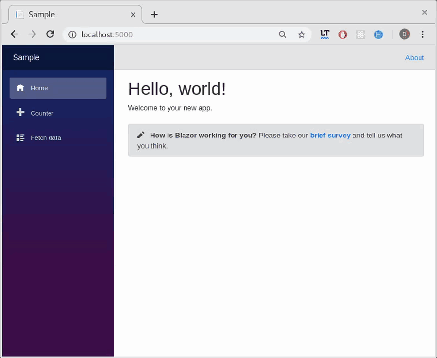

# BlazorConfirm

## Blazor Confirm Dialog | Blazor Confirm Close Tab 

A Blazor wrapper of 
[Window.confirm()](https://developer.mozilla.org/en-US/docs/Web/API/Window/confirm) 
and 
[onbeforeunload](https://developer.mozilla.org/en-US/docs/Web/API/WindowEventHandlers/onbeforeunload) 
confirmation as .Net Blazor Component. 

The sample project has been published [here](https://ctrl-alt-d.github.io/BlazorConfirm/).

```
Note: Just as Blazor, this repo is also experimental.
```

## Why confirm?

Remember:

>[Avoid using dialog boxes for confirmation.](https://alistapart.com/article/neveruseawarning)

... but in some cases we need them. 

## ScreenShot and Demo

Because we love screen shots and demos.

Demo: https://ctrl-alt-d.github.io/BlazorConfirm/




## Changes

- 0.6.0.1 
  - Handling onbeforeunload

- version 0.6.0
  - initial version for blazor 0.6.0


## Configuration

```
dotnet add package BlazorConfirm --version 0.6.0.1
```
Or:
```
Install-Package BlazorConfirm -Version 0.6.0.1
```

## Configure the dependency injection

Set DI on `ConfigureServices` of your `Startup.cs`:

```c#
using ctrlaltd.SimpleBlazorComponents;
using Microsoft.AspNetCore.Blazor.Builder;
using Microsoft.Extensions.DependencyInjection;

namespace Sample
{
    public class Startup
    {
        public void ConfigureServices(IServiceCollection services)
        {
            ...
            services.AddSingleton<IBlazorConfirmDialog, BlazorConfirmDialog>(); //Add as singleton.
        }
```

and add the component to `App.cshtml` (or to another component always loaded in the application)

```c#
@addTagHelper *, BlazorConfirm
<BlazorConfirmContainer />

<Router AppAssembly=typeof(Program).Assembly />
```

## Usage

In a component:

```c#
@inject ctrlaltd.SimpleBlazorComponents.IBlazorConfirmDialog blazorConfirmDialog
```

In a class:

```c#
[Inject] 
protected ctrlaltd.SimpleBlazorComponents.IBlazorConfirmDialog blazorConfirmDialog { get; set; }
```

At this point you can wrap your code into the `onSuccessDelegate` Dialog:

```c#
void IncrementCount()
{
    blazorConfirmDialog.NewDialog( message: "Are you sure do you want to increment the counter?", 
                                   onSuccessDelegate: ( () => {currentCount++;
                                                               StateHasChanged();
                                                               } ) );
}
```

A sample to confirm exit current page:

```c#
blazorConfirmDialog.NewDialog( onSuccessDelegate: (() => {UriHelper.NavigateTo(  "/fetchdata" );}));
```

## Credits

Dani Herrera

## License

BlazorConfirm is licensed under [MIT license](http://www.opensource.org/licenses/mit-license.php)

### Special Thanks

Thankyou to [@ghidello](https://github.com/ghidello) and  https://github.com/sotsera/sotsera.blazor.toaster repo.
